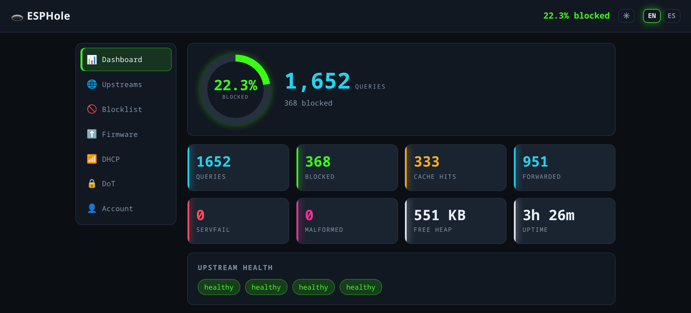

# 🕳️ ESPHole

A Pi-hole–style **DNS sinkhole** (network-wide ad & tracker blocker) ported to the
**ESP32-S3**. Every DNS query on your LAN passes through it: blocklisted domains die with a
black-hole answer (`0.0.0.0` / `::`), everything else is forwarded to an upstream resolver and
cached — and above all, **the network never loses DNS** even if blocking fails (fail-open).

**🌐 Live page & docs:** https://aguilerasmiguel.github.io/esphole/



> **Languages:** this README is in **English** first, **Español** below.
> Architecture doc: [`docs/ARCHITECTURE.en.md`](docs/ARCHITECTURE.en.md) ·
> [`docs/ARCHITECTURE.es.md`](docs/ARCHITECTURE.es.md).
> **Project web page:** the bilingual landing at [`docs/index.html`](docs/index.html) is served
> live via **GitHub Pages** at the link above.

---

## English

### Features

- **DNS core (RFC 1035 + EDNS0):** UDP + TCP on port 53, A/AAAA suffix blocking, upstream
  failover, cache, per-IP rate-limiting, **fail-open** (the LAN keeps resolving no matter what).
- **Wi-Fi provisioning:** captive AP portal on first boot (`ESPHole-XXXX`, per-device WPA2 key).
- **Web admin + HTTP API:** dashboard, config, cache, health. Login is **challenge-response**
  (the password never travels the wire).
- **Blocklists from URL:** download a HOSTS list over HTTPS and rebuild in place (no reboot).
- **OTA firmware updates:** HTTPS image with automatic rollback if the new build doesn't boot.
- **Optional DHCP server** *(⚠️ not yet tested end-to-end — see below).*
- **Encrypted upstream (DoT, RFC 7858):** forward queries over DNS-over-TLS with a **fail-closed**
  guarantee (never falls back to plaintext).
- **Per-client stats:** which IPs query, how much, how many blocked (ephemeral).
- **Bilingual UI (EN/ES)** and a **light/dark themed** redesign.

### Hardware

- **ESP32-S3-N16R8** (16 MB flash, 8 MB octal PSRAM). Other S3 variants may work with layout tweaks.
- USB-JTAG (built-in) for flashing — no download-mode button needed.

### Requirements

- **ESP-IDF v6.0.1** (this project is pinned to it). Install per Espressif's guide and export it:
  ```sh
  . $IDF_PATH/export.sh          # puts idf.py on PATH
  ```
- Python 3 (for the host tests and the blocklist tool), a C toolchain (comes with ESP-IDF),
  and `dig`/`curl` for on-target checks.

### Build & flash

```sh
cd firmware
idf.py set-target esp32s3        # first time only
idf.py build                     # compiles firmware + packs the web UI (www.bin)
idf.py -p /dev/ttyACM0 flash     # flashes bootloader, partition table, app, www
idf.py -p /dev/ttyACM0 monitor   # serial console (Ctrl-] to exit)
```

The web UI (`www/`) is packed into its own SPIFFS partition automatically during `build`.
A **blocklist** is optional at flash time — the easiest path is to add a list URL from the
web UI after boot (it downloads and applies it). To pre-flash one:

```sh
python tools/gen_blocklist.py <hosts-file> blocklist.bin
python -m esptool --chip esp32s3 -p /dev/ttyACM0 write-flash \
       $(python - <<'PY'
# the blocklist partition offset is resolved by name at runtime; see partitions.csv
PY
) blocklist.bin
```
*(In practice, just use the web UI’s “Update list” button — see the DoT/blocklist panels.)*

### First run

1. On first boot the device has no Wi-Fi and starts a **captive AP**. Check the **serial
   console** for the AP name and key:
   ```
   === MODO APROVISIONAMIENTO ===
     red:   ESPHole-XXXX
     clave: <auto-generated WPA2 key>
   ```
2. Join that Wi-Fi, open `http://192.168.4.1/`, and enter your home Wi-Fi credentials.
3. The device reboots onto your LAN. Point a client’s DNS at the device’s IP to use it.
4. Open `http://<device-ip>/` and **create your admin password** on the setup screen.

### Default passwords

- **Admin panel:** there is **no factory default** — you create it on first visit (setup page),
  stored as **PBKDF2-HMAC-SHA256(password, salt, 30000)**; the plaintext is never persisted or
  transmitted. Each device's owner sets their own.
- **Provisioning Wi-Fi AP:** SSID `ESPHole-XXXX` with a **per-device WPA2 key generated from the
  hardware RNG**, printed on the serial console at boot (see above). No fixed default.
- **Factory reset:** hold the **BOOT** button ≥3 s during operation to wipe credentials and the
  admin password and return to the AP portal.

### Testing

**Host tests** (pure logic modules, under ASan/UBSan — no device needed):
```sh
./test/host/run.sh               # NOTE: run WITHOUT the ESP-IDF env activated
```

**On-target checks** (safe, targeted `dig`/`curl` probes against the device):
```sh
./test/target/conformance.sh <device-ip>     # DNS core (17 checks)
./test/target/dot_safe.py <device-ip> <pw>   # DoT (fail-closed, failover, isolation)
./test/target/clients_safe.py <device-ip> <pw>
python3 test/target/i18n_check.py            # UI translation completeness
python3 test/target/ui_ids_check.py          # UI didn't break app.js
```
See the `.md` guides in `test/target/` for each spec.

### Project layout

```
firmware/
  components/   25 modules (pure + hardware); see docs/ARCHITECTURE
  main/         app_main.c — boot & wiring
  www/          web UI (index.html, style.css, app.js, i18n.js, theme.js)
  partitions.csv, sdkconfig.defaults, CMakeLists.txt
test/
  host/         Unity tests for pure modules
  target/       on-target guides + safe probe scripts
tools/          gen_blocklist.py
docs/           ARCHITECTURE.{en,es}.md
LICENSE         MIT
```

### License

**MIT** — see [`LICENSE`](LICENSE). Do whatever you want; no warranty.

---

## Español

Un **DNS sinkhole** (bloqueador de anuncios y rastreadores a nivel de red) estilo Pi-hole,
portado al **ESP32-S3**. Cada consulta DNS de la red pasa por aquí: los dominios en lista mueren
con una respuesta de agujero negro (`0.0.0.0` / `::`), el resto se reenvía a un resolvedor
upstream y se cachea — y sobre todo, **la red nunca se queda sin DNS** aunque el bloqueo falle
(fail-open).

### Funcionalidades

- **Núcleo DNS (RFC 1035 + EDNS0):** UDP + TCP en el puerto 53, bloqueo A/AAAA por sufijo,
  failover de upstreams, caché, límite de tasa por IP, **fail-open** (la red sigue resolviendo
  pase lo que pase).
- **Aprovisionamiento Wi-Fi:** portal cautivo (`ESPHole-XXXX`, clave WPA2 por dispositivo).
- **Web de administración + API HTTP:** panel, config, caché, salud. Login por
  **desafío-respuesta** (la contraseña nunca viaja por la red).
- **Listas desde URL:** descarga una lista HOSTS por HTTPS y la reconstruye en caliente (sin reboot).
- **Actualización OTA:** imagen por HTTPS con **vuelta atrás automática** si la nueva no arranca.
- **Servidor DHCP opcional** *(⚠️ aún sin probar de extremo a extremo — ver abajo).*
- **Upstream cifrado (DoT, RFC 7858):** reenvío por DNS-over-TLS con garantía **fail-closed**
  (nunca cae a texto plano).
- **Estadísticas por cliente:** qué IPs consultan, cuánto, cuántas bloqueadas (efímero).
- **Interfaz bilingüe (EN/ES)** y **rediseño con tema claro/oscuro**.

### Hardware

- **ESP32-S3-N16R8** (16 MB flash, 8 MB PSRAM octal). Otras variantes S3 pueden funcionar
  ajustando el particionado.
- USB-JTAG integrado para flashear — sin botón de modo descarga.

### Requisitos

- **ESP-IDF v6.0.1** (el proyecto está fijado a esta versión). Instálalo según la guía de
  Espressif y actívalo:
  ```sh
  . $IDF_PATH/export.sh          # pone idf.py en el PATH
  ```
- Python 3 (tests de host y el tool de listas), toolchain C (viene con ESP-IDF), y `dig`/`curl`
  para las comprobaciones on-target.

### Compilar y flashear

```sh
cd firmware
idf.py set-target esp32s3        # solo la primera vez
idf.py build                     # compila el firmware + empaqueta la web (www.bin)
idf.py -p /dev/ttyACM0 flash     # flashea bootloader, tabla de particiones, app y www
idf.py -p /dev/ttyACM0 monitor   # consola serie (Ctrl-] para salir)
```

La web (`www/`) se empaqueta en su propia partición SPIFFS durante el `build`. La **lista de
bloqueo** es opcional al flashear — lo más cómodo es añadir una URL de lista desde la web tras
arrancar (la descarga y aplica). Para preflashearla existe `tools/gen_blocklist.py`, pero en la
práctica basta con el botón **“Actualizar lista”** de la interfaz.

### Primer arranque

1. Sin Wi-Fi, el dispositivo levanta un **AP cautivo**. Mira la **consola serie** para ver el
   nombre y la clave:
   ```
   === MODO APROVISIONAMIENTO ===
     red:   ESPHole-XXXX
     clave: <clave WPA2 auto-generada>
   ```
2. Conéctate a esa Wi-Fi, abre `http://192.168.4.1/` e introduce las credenciales de tu Wi-Fi.
3. El dispositivo reinicia en tu red. Apunta el DNS de un cliente a su IP para usarlo.
4. Abre `http://<ip-del-dispositivo>/` y **crea tu contraseña de administración** en la pantalla
   de configuración inicial.

### Contraseñas por defecto

- **Panel de administración:** **no hay valor de fábrica** — la creas en la primera visita
  (pantalla de setup); se guarda como **PBKDF2-HMAC-SHA256(contraseña, salt, 30000)**; la
  contraseña en claro nunca se persiste ni viaja. El dueño de cada dispositivo pone la suya.
- **AP Wi-Fi de aprovisionamiento:** SSID `ESPHole-XXXX` con una **clave WPA2 por dispositivo
  generada del RNG del hardware**, impresa en la consola serie al arrancar (ver arriba). Sin
  valor fijo.
- **Reset de fábrica:** mantén el botón **BOOT** ≥3 s en operación para borrar credenciales y la
  contraseña de administración y volver al portal.

### Pruebas

**Tests de host** (módulos de lógica pura, bajo ASan/UBSan — sin dispositivo):
```sh
./test/host/run.sh               # OJO: ejecútalo SIN el entorno de ESP-IDF activado
```

**Comprobaciones on-target** (seguras: sondas `dig`/`curl` dirigidas al dispositivo):
```sh
./test/target/conformance.sh <ip>            # núcleo DNS (17 comprobaciones)
./test/target/dot_safe.py <ip> <contraseña>  # DoT (fail-closed, failover, aislamiento)
./test/target/clients_safe.py <ip> <contraseña>
python3 test/target/i18n_check.py            # completitud de traducciones
python3 test/target/ui_ids_check.py          # el rediseño no rompió app.js
```
Cada guía `.md` en `test/target/` documenta su spec.

### Estructura

```
firmware/
  components/   25 módulos (puros + hardware); ver docs/ARCHITECTURE
  main/         app_main.c — arranque y cableado
  www/          interfaz web (index.html, style.css, app.js, i18n.js, theme.js)
  partitions.csv, sdkconfig.defaults, CMakeLists.txt
test/
  host/         tests Unity de los módulos puros
  target/       guías on-target + scripts de sonda seguros
tools/          gen_blocklist.py
docs/           ARCHITECTURE.{en,es}.md
LICENSE         MIT
```

### Licencia

**MIT** — ver [`LICENSE`](LICENSE). Haz lo que quieras; sin garantía.
