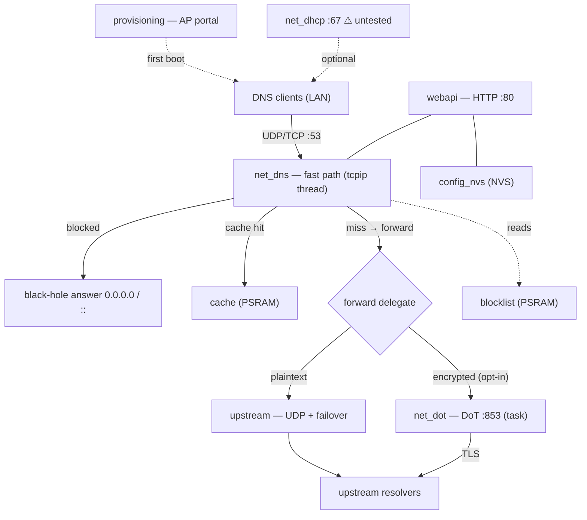
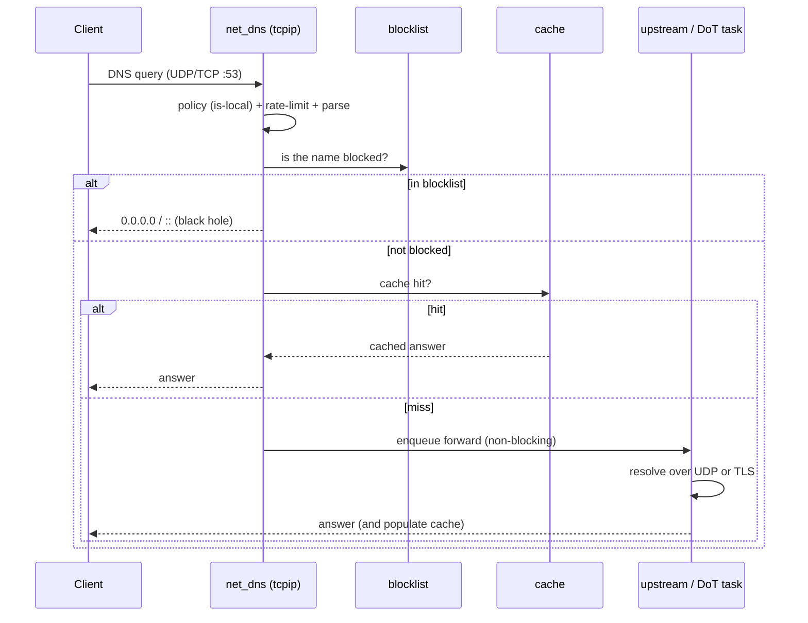

# ESPHole — Architecture

> Español: [`ARCHITECTURE.es.md`](ARCHITECTURE.es.md)

ESPHole is a DNS sinkhole for the **ESP32-S3**, built with the [Spec Kit](https://github.com/github/spec-kit)
methodology (constitution → spec → plan → research → contracts → tasks → TDD → on-hardware
verification). Ten specs (001–010) are implemented; each lived on its own branch and merged to
`main` after on-hardware verification.

---

## 1. Design philosophy (the constitution)

Every module obeys a project constitution. The load-bearing principles:

| # | Principle | What it means in practice |
|---|-----------|---------------------------|
| I | **Fail-open** | DNS must keep resolving even if blocking/cache/upstream fails. The LAN never loses name resolution. |
| II | **Resource budget** | Fixed-size tables, no hot-path heap allocation, bounded queues. |
| III | **DNS correctness** | RFC 1035 + EDNS0; hostile input never read out of bounds. |
| IV | **Bounded performance** | The fast path never blocks; slow work (TLS, HTTP, OTA) runs in dedicated tasks. |
| V | **Security by design** | Challenge-response auth, PBKDF2 password hashing, TLS cert validation, `textContent` (no `innerHTML`) for untrusted data. |
| VI | **API-first / decoupled web** | Everything is a REST/JSON endpoint; the UI is just a client. |
| VII | **Observability** | Metrics, per-client stats, health, status — all exposed. |
| VIII | **Atomic persistence** | Config in NVS, written per key. |
| IX | **Host-testable pure logic** | Wire parsing, blocklist, cache, framing… are ESP-IDF-free and unit-tested on the host under ASan/UBSan. |
| X | **Optional roles off by default** | DHCP, DoT are opt-in; disabled, the base DNS path is unchanged. |

**Pure vs hardware modules** is the core structural idea: all the tricky logic (DNS wire format,
blocklist matching, cache, DoT framing, DHCP wire, client table) lives in **pure C modules** with
no ESP-IDF dependency, unit-tested on a PC. The **hardware modules** are thin glue to lwIP,
esp-tls, esp_http_server, NVS, etc.

---

## 2. System overview

The **forward delegate** is a function pointer: by default it points to `upstream` (plaintext
UDP). When the user enables DoT, `net_dot` swaps it for its own queue-and-forward function and
restores it on disable — a single switch point, so the base path is untouched when DoT is off.

---

## 3. The DNS fast path

The heart of ESPHole. It runs **entirely in the lwIP tcpip thread** and **never blocks**:

If no upstream is reachable, the miss is answered with **SERVFAIL** (fail-open: better a bounded
failure than a hang). Per-client accounting happens right after the query is deemed valid, with a
single bounded table lookup — negligible next to the blocklist search over ~75 k domains.

---

## 4. Threading model

| Thread / task | Runs | Never does |
|---|---|---|
| **lwIP tcpip thread** | The whole fast path (parse, block, cache, enqueue) + timers | Blocking I/O (TLS, HTTP) |
| **`upstream`** | Plaintext UDP forward + failover (via a second raw pcb, also tcpip) | — |
| **`net_dot` task** | Persistent TLS connection, framed send/read, failover, fail-closed | Touch the fast path directly (only via queue + `tcpip_callback`) |
| **`webapi`** (esp_http_server task) | HTTP API + static UI | Slow the DNS path |
| **`listupdate` task** | Download + rebuild blocklist in place | — |
| **`otaupdate` task** | HTTPS image download + rollback arming | — |
| **`net_dhcp` task** | UDP :67 DHCP server (optional) | — |

Cross-thread hand-offs use bounded FreeRTOS queues and `tcpip_callback` (e.g. the DoT task caches
answers by hopping into the tcpip thread, so it never races the fast path).

---

## 5. Feature status (specs 001–010)

| Spec | Feature | Status |
|------|---------|--------|
| 001 | DNS core (UDP/TCP, block, cache, failover, rate-limit) | ✅ implemented & verified on hardware |
| 002 | Wi-Fi provisioning (AP portal) | ✅ implemented (manual portal walk-through pending) |
| 003 | HTTP API + web admin | ✅ implemented & verified |
| 004 | Blocklists from URL | ✅ implemented & verified |
| 005 | OTA firmware + rollback | ✅ implemented & verified (rollback provoked) |
| 006 | **DHCP server (optional)** | ⚠️ **implemented but NOT yet tested end-to-end** |
| 007 | Encrypted upstream (DoT) | ✅ implemented & verified (fail-closed, failover, isolation) |
| 008 | Per-client stats | ✅ implemented & verified |
| 009 | Bilingual UI (EN/ES) | ✅ implemented & verified |
| 010 | UX/UI redesign (sidebar, hero, themes) | ✅ implemented & verified |

### ⚠️ Important caveat: the DHCP server is untested

Spec 006 (`net_dhcp`, UDP :67) is **written and unit-tested at the pure-logic level**
(`dhcp_wire`, `dhcp_lease` have host tests), and its API/UI exist. But it has **not been exercised
end-to-end on a live network**: enabling a second DHCP server on a real LAN can hand out IPs and
disrupt other devices, so this was deliberately left for a controlled test network. **Treat the
DHCP server as experimental** until it has been validated with a real client on an isolated LAN
(the router's own DHCP must be disabled first). Everything else has been verified on the
ESP32-S3-N16R8 reference device.

---

## 6. Web UI (specs 003 / 009 / 010)

100 % self-contained (no CDNs, no external fonts — CSP-friendly), served from a SPIFFS partition:

- `index.html` — sidebar + one `<section>` per view.
- `style.css` — design tokens per theme (neon-on-dark + a light variant), the "sinkhole ring".
- `app.js` — API client + challenge-response crypto in pure JS (`crypto.subtle` is unavailable
  over plain HTTP, so SHA-256/HMAC/PBKDF2 are hand-rolled).
- `i18n.js` — `{key: {en, es}}` dictionary + `t()`; English default, remembered in `localStorage`.
- `theme.js` — light/dark (auto via `prefers-color-scheme` + override) and a hash router.

Translation completeness and ID preservation are guarded by static checks
(`test/target/i18n_check.py`, `ui_ids_check.py`).

---

## 7. Future improvements

- **Validate & harden the DHCP server** on an isolated LAN, then enable it by default only after
  it earns the same confidence as the rest.
- **DoH** (DNS-over-HTTPS) as an alternative encrypted transport, and a **DoT/DoH server** toward
  clients (currently ESPHole is only a DoT *client* upstream).
- **Historical metrics** (small ring buffers) to draw query/block graphs over time.
- **Per-client policies** (allow/deny lists or different upstreams per device).
- **Device names in the client table** by enriching from DHCP leases when the DHCP server is on.
- **More languages** (the i18n layer already supports adding them; only EN/ES ship today).
- **HTTPS for the admin UI** (self-signed) so `crypto.subtle` becomes available and the panel is
  encrypted on the LAN.
- **Signed OTA images** (secure boot / image signature) to complement the HTTPS-only download.

---

## 8. Security notes

- Admin login is **challenge-response**: the browser derives `PBKDF2-HMAC-SHA256(password, salt,
  30000)` and answers `HMAC(key, nonce)` — the password never crosses the wire and is never stored
  in plaintext.
- OTA and blocklist downloads are **HTTPS with CA-bundle validation** by default (plaintext HTTP is
  a dev-only opt-in for OTA, off by default).
- DoT connects **by IP** but validates the resolver's certificate against its **hostname** (SNI),
  so enabling encryption doesn't leak the resolver via a plaintext bootstrap lookup.
- All client-supplied strings (hostnames, IPs, lease names) are rendered with `textContent`, never
  `innerHTML`.
