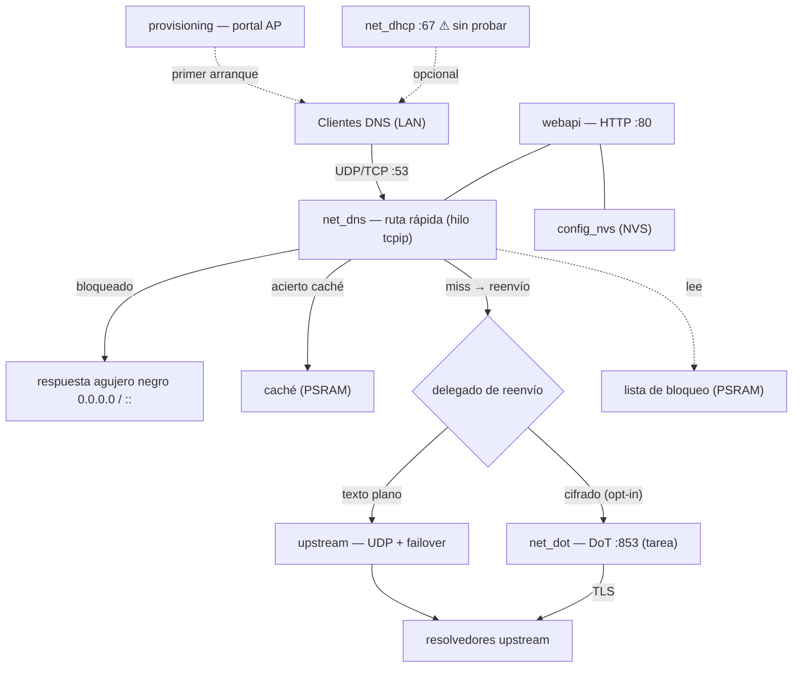
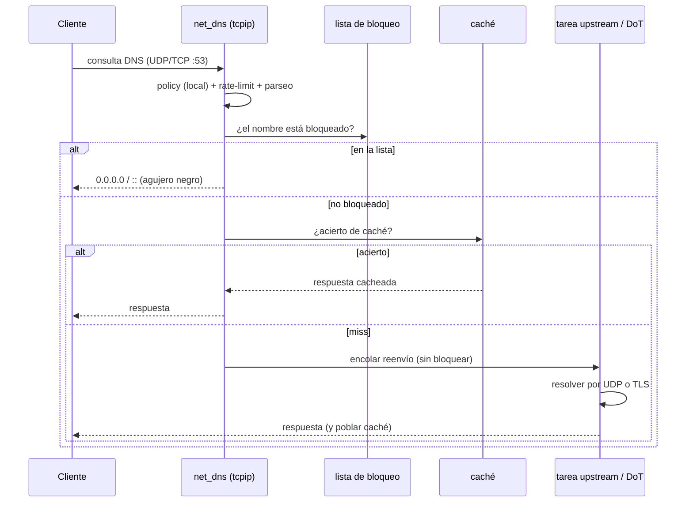

# ESPHole — Arquitectura

> English: [`ARCHITECTURE.en.md`](ARCHITECTURE.en.md)

ESPHole es un *DNS sinkhole* para **ESP32-S3**, construido con la metodología
[Spec Kit](https://github.com/github/spec-kit) (constitución → spec → plan → investigación →
contratos → tareas → TDD → verificación en hardware). Hay diez specs (001–010) implementadas;
cada una vivió en su propia rama y se integró en `main` tras verificarse en hardware.

---

## 1. Filosofía de diseño (la constitución)

Cada módulo obedece a una constitución del proyecto. Los principios que sostienen todo:

| # | Principio | Qué significa en la práctica |
|---|-----------|------------------------------|
| I | **Fail-open** | El DNS debe seguir resolviendo aunque fallen el bloqueo/caché/upstream. La red nunca se queda sin resolución. |
| II | **Presupuesto de recursos** | Tablas de tamaño fijo, sin asignación de heap en la ruta caliente, colas acotadas. |
| III | **Corrección DNS** | RFC 1035 + EDNS0; la entrada hostil nunca se lee fuera de rango. |
| IV | **Rendimiento acotado** | La ruta rápida nunca bloquea; el trabajo lento (TLS, HTTP, OTA) va en tareas dedicadas. |
| V | **Seguridad por diseño** | Auth por desafío-respuesta, hash PBKDF2, validación de certificado TLS, `textContent` (nunca `innerHTML`) para datos no confiables. |
| VI | **API primero / web desacoplada** | Todo es un endpoint REST/JSON; la UI es solo un cliente. |
| VII | **Observabilidad** | Métricas, estadísticas por cliente, salud, estado — todo expuesto. |
| VIII | **Persistencia atómica** | Configuración en NVS, escrita por clave. |
| IX | **Lógica pura testeable en host** | El parseo wire, la lista de bloqueo, la caché, el framing… no dependen de ESP-IDF y se testean en el PC bajo ASan/UBSan. |
| X | **Roles opcionales apagados por defecto** | DHCP y DoT son opt-in; apagados, la ruta DNS base no cambia. |

**Módulos puros vs. de hardware** es la idea estructural central: toda la lógica delicada
(formato wire DNS, coincidencia de lista, caché, framing DoT, wire DHCP, tabla de clientes) vive
en **módulos C puros** sin dependencia de ESP-IDF, testeados en un PC. Los **módulos de hardware**
son pegamento fino con lwIP, esp-tls, esp_http_server, NVS, etc.

---

## 2. Visión general del sistema

El **delegado de reenvío** es un puntero a función: por defecto apunta a `upstream` (UDP en
claro). Cuando el usuario activa DoT, `net_dot` lo cambia por su propia función de encolar-y-
reenviar y lo restaura al desactivar — un único punto de conmutación, así la ruta base queda
intacta con DoT apagado.

---

## 3. La ruta rápida DNS

El corazón de ESPHole. Corre **enteramente en el hilo tcpip de lwIP** y **nunca bloquea**:

Si ningún upstream es alcanzable, el miss se responde con **SERVFAIL** (fail-open: mejor un fallo
acotado que un cuelgue). La contabilidad por cliente ocurre justo tras validar la consulta, con
una sola búsqueda en una tabla acotada — insignificante frente a la búsqueda en la lista de
bloqueo sobre ~75 k dominios.

---

## 4. Modelo de hilos

| Hilo / tarea | Hace | Nunca hace |
|---|---|---|
| **Hilo tcpip de lwIP** | Toda la ruta rápida (parseo, bloqueo, caché, encolar) + timers | E/S bloqueante (TLS, HTTP) |
| **`upstream`** | Reenvío UDP en claro + failover (segundo pcb raw, también tcpip) | — |
| **Tarea `net_dot`** | Conexión TLS persistente, envío/lectura con framing, failover, fail-closed | Tocar la ruta rápida directamente (solo vía cola + `tcpip_callback`) |
| **`webapi`** (tarea esp_http_server) | API HTTP + UI estática | Ralentizar la ruta DNS |
| **Tarea `listupdate`** | Descargar + reconstruir la lista en caliente | — |
| **Tarea `otaupdate`** | Descarga HTTPS de imagen + armado del rollback | — |
| **Tarea `net_dhcp`** | Servidor DHCP UDP :67 (opcional) | — |

Los traspasos entre hilos usan colas FreeRTOS acotadas y `tcpip_callback` (p. ej. la tarea DoT
cachea respuestas saltando al hilo tcpip, así nunca compite con la ruta rápida).

---

## 5. Estado de las funcionalidades (specs 001–010)

| Spec | Funcionalidad | Estado |
|------|---------------|--------|
| 001 | Núcleo DNS (UDP/TCP, bloqueo, caché, failover, rate-limit) | ✅ implementada y verificada en hardware |
| 002 | Aprovisionamiento Wi-Fi (portal AP) | ✅ implementada (prueba manual del portal pendiente) |
| 003 | API HTTP + web de administración | ✅ implementada y verificada |
| 004 | Listas desde URL | ✅ implementada y verificada |
| 005 | OTA de firmware + rollback | ✅ implementada y verificada (rollback provocado) |
| 006 | **Servidor DHCP (opcional)** | ⚠️ **implementada pero AÚN SIN PROBAR de extremo a extremo** |
| 007 | Upstream cifrado (DoT) | ✅ implementada y verificada (fail-closed, failover, aislamiento) |
| 008 | Estadísticas por cliente | ✅ implementada y verificada |
| 009 | Interfaz bilingüe (EN/ES) | ✅ implementada y verificada |
| 010 | Rediseño de UX/UI (sidebar, hero, temas) | ✅ implementada y verificada |

### ⚠️ Advertencia importante: el servidor DHCP no está probado

La spec 006 (`net_dhcp`, UDP :67) está **escrita y testeada a nivel de lógica pura**
(`dhcp_wire`, `dhcp_lease` tienen tests de host), y su API/UI existen. Pero **no se ha ejercitado
de extremo a extremo en una red real**: activar un segundo servidor DHCP en una LAN real puede
repartir IPs y perturbar otros dispositivos, así que se dejó a propósito para una red de prueba
controlada. **Trata el servidor DHCP como experimental** hasta validarlo con un cliente real en
una LAN aislada (hay que desactivar antes el DHCP del router). Todo lo demás se ha verificado en
el dispositivo de referencia ESP32-S3-N16R8.

---

## 6. Interfaz web (specs 003 / 009 / 010)

100 % autocontenida (sin CDNs, sin fuentes externas — compatible con CSP), servida desde una
partición SPIFFS:

- `index.html` — sidebar + una `<section>` por vista.
- `style.css` — tokens de diseño por tema (neón sobre oscuro + variante clara), el "anillo sinkhole".
- `app.js` — cliente de la API + cripto de desafío-respuesta en JS puro (`crypto.subtle` no está
  disponible sobre HTTP plano, así que SHA-256/HMAC/PBKDF2 van a mano).
- `i18n.js` — diccionario `{clave: {en, es}}` + `t()`; inglés por defecto, recordado en `localStorage`.
- `theme.js` — claro/oscuro (auto vía `prefers-color-scheme` + override) y un router por hash.

La completitud de traducciones y la preservación de IDs se garantizan con chequeos estáticos
(`test/target/i18n_check.py`, `ui_ids_check.py`).

---

## 7. Mejoras futuras

- **Validar y endurecer el servidor DHCP** en una LAN aislada, y activarlo por defecto solo cuando
  gane la misma confianza que el resto.
- **DoH** (DNS-over-HTTPS) como transporte cifrado alternativo, y un **servidor DoT/DoH** hacia los
  clientes (hoy ESPHole es solo *cliente* DoT hacia el upstream).
- **Métricas históricas** (pequeños ring buffers) para dibujar gráficas de consultas/bloqueo.
- **Políticas por cliente** (listas permitir/denegar o distintos upstreams por dispositivo).
- **Nombres de dispositivo en la tabla de clientes** enriqueciendo desde las concesiones DHCP
  cuando el servidor DHCP esté activo.
- **Más idiomas** (la capa i18n ya lo permite; hoy solo se envían EN/ES).
- **HTTPS para la web de administración** (autofirmado) para que `crypto.subtle` esté disponible y
  el panel viaje cifrado en la LAN.
- **Imágenes OTA firmadas** (secure boot / firma de imagen) para complementar la descarga HTTPS.

---

## 8. Notas de seguridad

- El login de administración es por **desafío-respuesta**: el navegador deriva
  `PBKDF2-HMAC-SHA256(contraseña, salt, 30000)` y responde `HMAC(clave, nonce)` — la contraseña
  nunca cruza la red ni se guarda en claro.
- Las descargas OTA y de listas son **HTTPS con validación del bundle de CAs** por defecto (el HTTP
  en claro es un opt-in solo para desarrollo en OTA, apagado por defecto).
- DoT conecta **por IP** pero valida el certificado del resolvedor contra su **hostname** (SNI),
  así activar el cifrado no filtra el resolvedor por una resolución de arranque en claro.
- Todas las cadenas del cliente (hostnames, IPs, nombres de concesión) se renderizan con
  `textContent`, nunca `innerHTML`.
